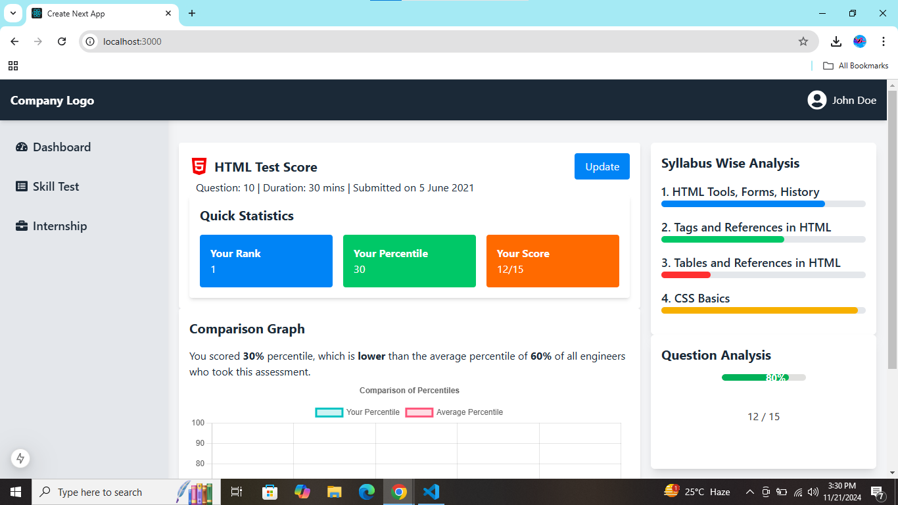
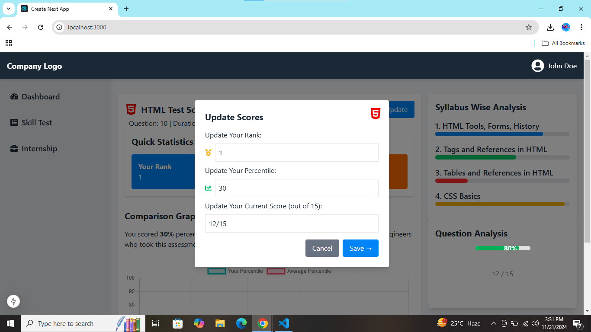

# Skill Test Dashboard
A responsive web dashboard for skill assessments built with Next.js and Tailwind CSS. The project allows users to view and update their test scores, compare their performance with others, and analyze their results in detail.

/skill-test-dashboard
├── public/
│   ├── logo.png            # Company logo
│   └── profile.jpg         # Sample profile image
├── src/
│   ├── components/
│   │   ├── Header.tsx      # Header component with logo and profile
│   │   ├── Sidebar.tsx     # Sidebar menu
│   │   ├── UpdateModal.tsx # Modal for updating scores
│   │   ├── QuickStats.tsx  # Quick Statistics card
│   │   ├── ComparisonGraph.tsx # Comparison Graph card
│   │   ├── SyllabusAnalysis.tsx # Syllabus Analysis card
│   │   ├── QuestionAnalysis.tsx # Question Analysis card
│   └── pages/
│       ├── index.tsx       # Main page
│       └── _app.tsx        # App wrapper
├── styles/
│   └── globals.css         # TailwindCSS styles
├── package.json
├── tsconfig.json
└── README.md
Installation
Clone the repository:

git clone https://github.com/yourusername/skill-test-dashboard.git
cd skill-test-dashboard

Install dependencies:
npm install

Run the development server:
npm run dev
Open http://localhost:3000 in your browser to view the project.

# Technologies Used
Next.js: For building the application.
Tailwind CSS: For styling and responsiveness.
React Icons: For menu icons.
Chart.js: For creating graphs.

# Usage
Test Updates: Use the "Update" button to update rank, percentile, and score.
Quick Statistics: View your rank, percentile, and correct answers in a concise card.
Graphs: Compare your performance with the average.
Detailed Analysis: Review your syllabus-wise and question-wise performance.

# Screenshot

